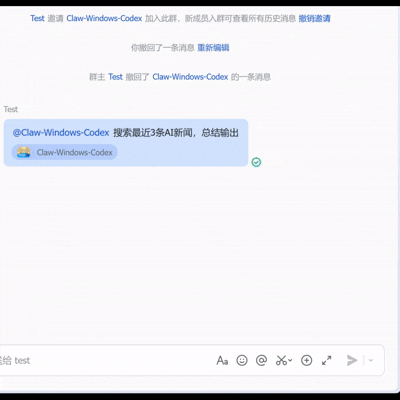

English | [中文](./README.md)

# OpenClaw Lark/Feishu Plugin — Stream Card Fork



Fork of the official [openclaw-larksuite](https://github.com/larksuite/openclaw-larksuite) plugin with **streaming block output** and **tool call indicators**.

## ✨ What's Changed

The official plugin delivers LLM block results all at once after completion. This fork enables:

- **Real-time streaming output** — each block's content is progressively appended to the streaming card as it's generated
- **Group chat streaming** — streaming output works in group chats as well
- **Tool call indicators** — when the agent calls a tool, the card shows the current tool at the top in real-time, with a collapsible summary panel on completion

## 📢 News

- **2026.3.23** — First release with real-time streaming output and tool call indicators

## 📦 Installation

Requires [OpenClaw](https://openclaw.ai) and Node.js (>= v22).

> [!WARNING]
> - OpenClaw **3.22** has breaking changes that cause plugin errors. Compatibility fix is in progress, expected by **Mar 24**. Please use version 3.13 for now: `npm install -g openclaw@2026.3.13` (check version: `openclaw -v`)
> - **Alibaba Cloud OpenClaw plans** are not supported due to permission restrictions. Please use a self-hosted server.

```bash
npx -y @colinlu50/openclaw-lark-stream install
```

### From source (for development)

```bash
cd ~/.openclaw/extensions
git clone https://github.com/ColinLu50/openclaw-lark-stream.git openclaw-lark-stream
cd openclaw-lark-stream && npm install && npm run build
openclaw gateway restart
```

## ⚙️ Configuration

### Streaming Output

Streaming is enabled by default after installation. To disable:

```bash
openclaw config set channels.feishu.streaming false
openclaw config set channels.feishu.replyMode.direct card
openclaw config set channels.feishu.replyMode.group card
openclaw config set channels.feishu.replyMode.default card
openclaw gateway restart
```

To re-enable:

```bash
openclaw config set channels.feishu.streaming true
openclaw config set channels.feishu.replyMode.direct streaming
openclaw config set channels.feishu.replyMode.group streaming
openclaw config set channels.feishu.replyMode.default streaming
openclaw gateway restart
```

### Card Footer

Elapsed time and completion status are shown by default. To disable:

```bash
openclaw config set channels.feishu.footer.elapsed false  # hide elapsed time
openclaw config set channels.feishu.footer.status false   # hide completion status
```

- **elapsed** — displays total response time (e.g. `Elapsed 3.2s`) in the card footer
- **status** — displays completion state (`Completed` / `Error` / `Stopped`) in the card footer

## 📄 License

MIT
